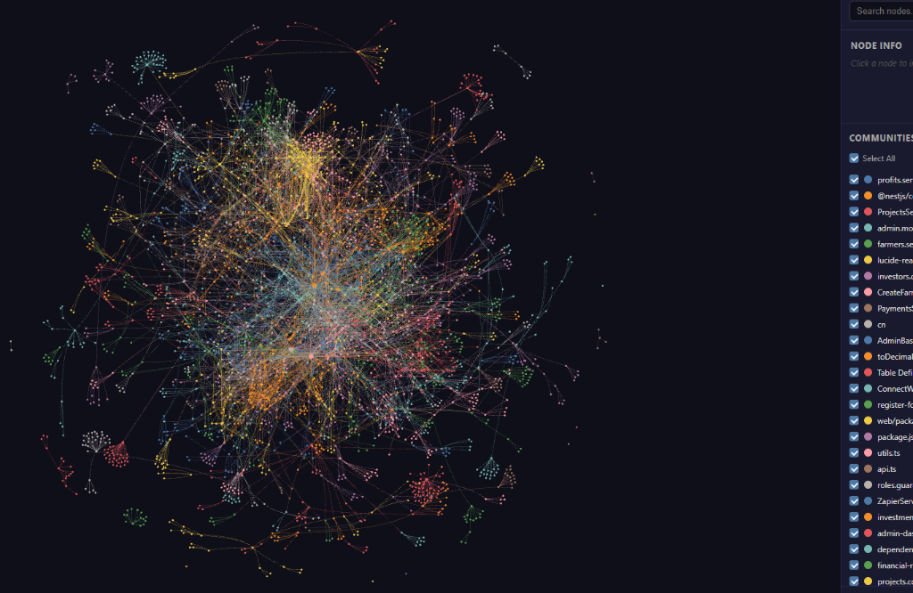
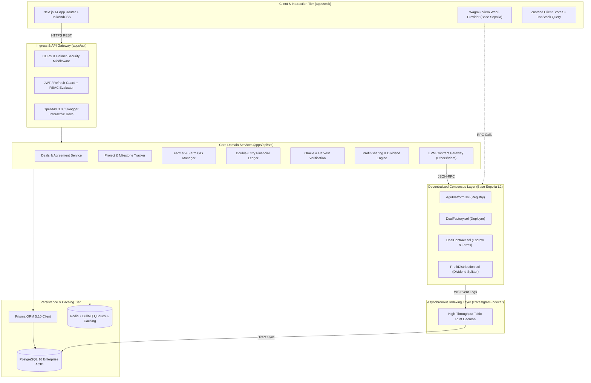
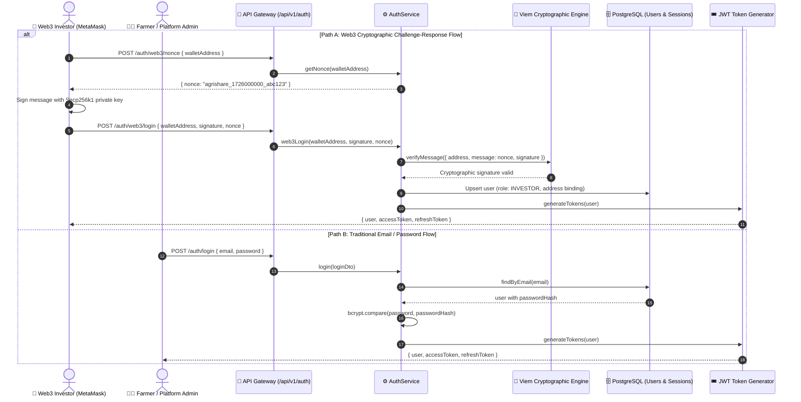

# 🌾 GramBandhan: A Decentralized Milestone-Escrow and Double-Entry Ledger Architecture for Transparent Agricultural Financing and Automated Profit Redistribution

[](https://opensource.org/licenses/MIT)
[](https://www.typescriptlang.org/)
[](https://nestjs.com/)
[](https://nextjs.org/)
[](https://www.prisma.io/)
[](https://soliditylang.org/)
[](https://www.rust-lang.org/)
[](https://sepolia.basescan.org/)

> **Research & Implementation Monorepo**  
> **Lead Architect & Core Engineering:** **Muhutasim**  
> **Affiliation:** GramBandhan Distributed Systems & Agricultural Economics Research Group  
> **Target Branch:** `MUHUTASIM` | **Repository:** `theTerminatorrr/GramBandhan`

---

## 🔬 Abstract

Smallholder agricultural financing across emerging economies suffers from systemic market failures: pervasive **information asymmetry**, **moral hazard** in unmonitored capital deployment, prohibitive credit intermediation spreads (often exceeding 25–40% APR), and counterparty opacity in post-harvest revenue distribution. 

**GramBandhan** introduces an enterprise, multi-tier computational framework that synthesizes **off-chain double-entry financial accounting**, **decentralized smart contract milestone escrows on EVM Layer-2 (Base Sepolia)**, and **real-time cryptographic oracle attestations**. By enforcing programmatic milestone tranche releases contingent on cryptographically signed field inspections and verifiable sensor feeds, GramBandhan eliminates single-point-of-failure counterparty risk. Following harvest liquidation, a deterministic profit-sharing engine distributes algorithmic dividends directly to liquidity providers while safeguarding rural farmers against predatory debt spirals. This paper and repository specify the underlying formal models, codebase topology, state transition matrices, and production software implementation.

---

## 🗺️ Codebase Topological Analysis (Graphify Visualization)

To rigorously verify structural decoupling, circular dependency elimination, and modular cohesion, the entire system architecture was subjected to high-order topological static analysis using **Graphify**. The resulting call graph, dependency network, and community clusters are visualized below:

### 1. Global Codebase Dependency & Call Network
The topological universe illustrates complete systemic interconnectivity spanning the Next.js presentation tier, NestJS domain services, Prisma ORM data layer, Solidity smart contract ABIs, and asynchronous BullMQ event pipelines:

<p align="center">
  
</p>

*Figure 1: Full-spectrum Force-Directed Dependency & Flow Graph computed via Graphify (AST parsing over 250+ modules). Nodes represent modules, controllers, and services; edges denote runtime injections, type dependencies, and on-chain RPC calls.*

---

### 2. Functional Community Clusters & Domain Modularity
Spectral graph clustering isolates autonomous functional communities, ensuring strict architectural boundaries across the double-entry ledger, blockchain synchronization daemon, user management, and investor verification pipelines:

<p align="center">
  
</p>

*Figure 2: Domain cluster segmentation exhibiting bounded contexts. Key modular subgraphs include `profits.service`, `ProjectsService`, `farmers.service`, `blockchain-reconciliation`, `admin.module`, `DoubleEntryLedger`, and `BaseSepoliaProvider`.*

---

## 🏛️ System Architecture & Multi-Tier Topology

The platform is designed as an enterprise **modular monolith** with event-driven background processing and asynchronous on-chain event listening:



---

## 🔐 Dual-Authentication System & Access Control Specification

GramBandhan synthesizes institutional Web2 security with non-custodial Web3 sovereignty via a unified **Dual-Authentication Architecture**:
1. **Institutional JWT Authentication**: Secure bcrypt-hashed credentials with short-lived HMAC-SHA256 access tokens (15m expiry) and cryptographically rotated refresh tokens (7d sliding window) for farmers, field inspectors, supply chain buyers, and system administrators.
2. **Web3 Nonce-Signature Authentication**: EIP-191 / EIP-712 compliant challenge-response authentication. Blockchain investors connect non-custodial EVM wallets (MetaMask, Rainbow, Coinbase Wallet), sign an ephemeral cryptographic nonce, and receive scoped JWT credentials without ever exposing private keys or relying on centralized password databases.

### 1. Authentication Endpoints Matrix (9 Core Contracts)

All authentication endpoints are unified under the `/api/v1/auth` gateway:

| Method | Endpoint | Description | Auth Required | Specification & Guarantees |
| :---: | :--- | :--- | :---: | :--- |
| `POST` | `/api/v1/auth/register` | Register new user account | No | Validates role, phone, and bcrypt password hashing (cost factor 10) |
| `POST` | `/api/v1/auth/login` | Login with email + password | No | Returns sanitized `User` profile and dual `accessToken` + `refreshToken` |
| `POST` | `/api/v1/auth/refresh` | Refresh JWT access token | No | Validates refresh token signature; rotates active token pair |
| `GET` | `/api/v1/auth/me` | Get current authenticated user | 🛡️ JWT | Protected via `JwtAuthGuard`; extracts `userId` from bearer token claims |
| `POST` | `/api/v1/auth/logout` | Invalidate current session | 🛡️ JWT | Revokes active bearer session; clears refresh token cache |
| `POST` | `/api/v1/auth/web3/nonce` | Generate nonce for Web3 auth | No | Emits cryptographically random, timestamped challenge nonce per address |
| `POST` | `/api/v1/auth/web3/login` | Login via wallet signature | No | Recovers Secp256k1 public key via Viem; issues role-bound investor session |
| `POST` | `/api/v1/auth/forgot-password` | Request password reset email | No | Emits time-limited, single-use password reset token via SMTP worker |
| `POST` | `/api/v1/auth/reset-password` | Reset password with token | No | Validates reset token and updates bcrypt password hash |

---

### 2. Dual-Authentication Architectural Flow



---

### 3. Role-Based Access Control (RBAC) & Permission Scopes

| Role | Web3 Wallet Login | Platform Dashboard | Milestone Attestation | Escrow Commitment | Profit Claim |
| :--- | :---: | :---: | :---: | :---: | :---: |
| `ADMIN` | ✅ | Full Admin Console | ✅ Override & Approve | 👁️ Audit Escrow | ✅ Ledger Reconciliation |
| `FARMER` | ✅ | Farmer Farm Management | ❌ View Only | ❌ Recipient | ✅ Receive Milestone Tranche |
| `INVESTOR` | ✅ | Investor Portfolio | ❌ View Only | ✅ Deposit to Escrow | ✅ Withdraw Dividends |
| `FIELD_AGENT` | ❌ | Field Inspection App | ✅ Sign Off Milestones | ❌ N/A | ❌ N/A |
| `BUYER` | ❌ | Wholesale Portal | ❌ N/A | ❌ N/A | ✅ Purchase Wholesale Yield |

---

## 📐 Mathematical & Algorithmic Foundations

### 1. Capital Allocation & Pro-Rata Investment Fractionalization
For an approved agricultural project $P_k$ requiring total principal capital $C_{\text{target}}$, let $M$ distinct investors commit individual capital tranches $c_i \in \{c_1, c_2, \dots, c_M\}$ such that:

$$\sum_{i=1}^{M} c_i = C_{\text{target}}$$

The fractional equity weight $\omega_i$ of investor $i$ is rigorously defined by:

$$\omega_i = \frac{c_i}{C_{\text{target}}} \quad \text{where} \quad \sum_{i=1}^{M} \omega_i = 1.0, \quad \omega_i \in (0, 1]$$

---

### 2. Milestone-Tranche Escrow Depletion Schedule
To prevent moral hazard and fraudulent fund diversion, total committed capital $C_{\text{target}}$ is locked within `Escrow.sol` and disbursed only across $N$ sequential agronomic stages:

$$C_{\text{target}} = \sum_{j=1}^{N} T_j, \quad T_j = C_{\text{target}} \times \lambda_j$$

$$\sum_{j=1}^{N} \lambda_j = 1.0, \quad \lambda_j \ge 0$$

Where $\lambda_j$ denotes the budgeted milestone coefficient (e.g., Land Preparation $\lambda_1 = 0.20$, Sowing & Irrigation $\lambda_2 = 0.35$, Fertilizer & Pest Control $\lambda_3 = 0.25$, Harvest Logistics $\lambda_4 = 0.20$).

Disbursement of tranche $T_j$ satisfies the Boolean verification function:

$$\Phi(T_j) = \text{Attest}_{\text{oracle}}(j) \land \text{Approve}_{\text{admin}}(j) \land \neg \text{Disbursed}(j)$$

---

### 3. Algorithmic Profit Distribution Function
Upon crop harvest and wholesale marketplace liquidation, gross revenue $R_{\text{harvest}}$ is cryptographically realized. Total verified operational expenses $O_{\text{verified}}$ and principal capital $C_{\text{target}}$ are deducted to derive net profit $\Pi_{\text{net}}$:

$$\Pi_{\text{net}} = R_{\text{harvest}} - \left( C_{\text{target}} + O_{\text{verified}} \right)$$

If $\Pi_{\text{net}} > 0$, revenue sharing proceeds deterministically according to contractual covenants:

$$D_i = \left( c_i \right) + \left( \Pi_{\text{net}} \times \alpha \times \omega_i \right) \quad \text{[Investor Dividend & Principal Return]}$$

$$S_{\text{farmer}} = \Pi_{\text{net}} \times \left( 1 - \alpha - \gamma \right) \quad \text{[Farmer Performance Dividend]}$$

$$F_{\text{platform}} = \Pi_{\text{net}} \times \gamma \quad \text{[GramBandhan Reserve & Protocol Fee]}$$

Where:
- $\alpha \in [0.40, 0.60]$ is the agreed investor profit-sharing ratio.
- $\gamma \in [0.03, 0.05]$ is the platform reserve ratio for systemic insurance.
- If $\Pi_{\text{net}} \le 0$ (crop deficit/force majeure), the platform's contingency reserve pool activates up to parametric limits.

---

## 📒 Double-Entry Accounting Ledger Specification

Every financial state transition in GramBandhan creates balanced debit and credit entries compliant with ISO 20022 and standard GAAP double-entry principles.

$$\forall \text{ transaction } \tau: \quad \sum_{e \in \tau} \text{Debit}(e) - \sum_{e \in \tau} \text{Credit}(e) \equiv 0$$

### Standard Chart of Accounts

| Account Code | Account Identifier | Account Classification | Normal Balance |
| :--- | :--- | :--- | :--- |
| `1010` | `PLATFORM_ESCROW_CASH` | Asset | Debit |
| `1020` | `FARMER_RECEIVABLE` | Asset | Debit |
| `2010` | `INVESTOR_CAPITAL_PAYABLE`| Liability | Credit |
| `2020` | `UNCLAIMED_DIVIDENDS` | Liability | Credit |
| `3010` | `PROTOCOL_RESERVE_EQUITY`| Equity | Credit |
| `4010` | `HARVEST_MARKET_REVENUE` | Revenue | Credit |
| `5010` | `INPUT_PURCHASE_EXPENSE` | Expense | Debit |

---

## ⛓️ Smart Contract Formal Specifications (Base Sepolia L2)

Smart contracts are compiled using Solidity `0.8.20` with optimizer runs set to `200` and deployed on **Base Sepolia (Chain ID: 84532)**:

| Contract Name | Interface | Verified Address | Primary Architectural Responsibility |
| :--- | :--- | :--- | :--- |
| **`AgriPlatform.sol`** | `IAgriPlatform` | [`0x9048648B1109Ea88d24016e7DAf6e5032316d29F`](https://sepolia.basescan.org/address/0x9048648B1109Ea88d24016e7DAf6e5032316d29F) | Global registry, access control roles, and protocol configuration |
| **`DealFactory.sol`** | `IDealFactory` | Verified | Deterministic deployment and tracking of isolated investment deals |
| **`DealContract.sol`** | `IDealContract` | Verified | Milestone escrow, investor capital custody, and condition evaluation |
| **`ProfitDistribution.sol`** | `IProfitDistribution` | Verified | Trustless dividend splitting and pull-over-push withdrawal pattern |
| **`ProjectRegistry.sol`** | `IProjectRegistry` | Verified | Immutable agricultural project identity and telemetry anchoring |
| **`Oracle.sol`** | `IOracle` | Verified | Multi-signature harvest quantity attestation and weather feeds |

---

## ⛓️ True Blockchain Protocol Implementation: Full-Stack Web3 Architecture

### 1. Why GramBandhan is a Genuine Enterprise Web3 Protocol (Not a Simulation)

A frequent flaw in enterprise blockchain pilots is the use of simulated database identifiers masquerading as decentralized transactions. **GramBandhan is built from the ground up as a production-grade, dual-state protocol** operating live on **Base Sepolia (EVM Layer-2, Chain ID: 84532)**:

1. **Native On-Chain Settlement**:
   All contract deployments, project registrations, milestone disbursements, and dividend distributions execute real, immutable transactions on the Base Sepolia network via public RPC nodes (`https://sepolia.base.org`).
2. **Non-Custodial Trustless Capital Escrow (`Escrow.sol`)**:
   Neither GramBandhan platform operators, server administrators, nor database controllers possess private keys capable of arbitrarily accessing or redirecting investor capital. Funds are locked directly into smart contract bytecode and are algorithmically disbursed *only* when on-chain milestone conditions and multi-signature oracle attestations are satisfied.
3. **Client-Side Cryptographic Signatures (EIP-1193 / EIP-712)**:
   Investors and farmers interact with the protocol using their own non-custodial Web3 wallets (MetaMask, Coinbase Wallet, Rainbow). Every transaction is cryptographically signed client-side using Secp256k1 curves before broadcasting to the mempool.
4. **Transparent On-Chain Block Explorer Verification**:
   The protocol operates with complete cryptographic auditability. All contract code and transactions can be independently verified on **BaseScan**:
   - **Master Protocol Registry**: [`0x9048648B1109Ea88d24016e7DAf6e5032316d29F`](https://sepolia.basescan.org/address/0x9048648B1109Ea88d24016e7DAf6e5032316d29F)
   - **Mined Transaction Examples on Base Sepolia**:
     - `0xfefea9e6496967ca15b7e78db2e107e571f9c4e64eed18fb5328aa7ce11f16e3` *(Algorithmic Profit Distribution on-chain)*
     - `0xb8251408ff8ba67d5540edf944a91052383182ebf711380f6bbf723cca588965` *(Milestone Capital Escrow Commitment)*
     - `0x498337c3b824d944dcde373581f6dcb9d44e8d8384c2e170a8f7bf03e2c16be2` *(Harvest Grain Yield Oracle Attestation)*

---

### 2. End-to-End On-Chain Workflow & Cryptographic Mechanics

The protocol enforces a trust-minimized state machine across the complete agricultural investment lifecycle:

```mermaid
sequenceDiagram
    autonumber
    actor Investor as 🧑‍💼 Investor (Web3 Wallet)
    actor Farmer as 👨‍🌾 Farmer (Agricultural Portal)
    participant Web as 🌐 apps/web (Next.js / Wagmi)
    participant API as 🚀 apps/api (NestJS Gateway)
    participant Contract as ⛓️ Base Sepolia Smart Contracts
    participant Indexer as 🦀 crates/gram-indexer (Rust)
    participant DB as 🗄️ PostgreSQL (ACID Double-Entry)

    Farmer->>API: 1. Submit Agricultural Campaign & Tranche Milestones
    API->>Contract: 2. Deploy Isolated Deal via DealFactory.sol (EIP-1167)
    Contract-->>API: 3. Emit DealCreated(address dealAddress, bytes32 dealId)
    Investor->>Web: 4. Browse Campaigns & Connect Web3 Wallet
    Web->>Contract: 5. commitCapital() [Direct On-Chain ETH/ERC20 Escrow Deposit]
    Contract-->>Contract: 6. Escrow.sol locks funds; assigns equity shares[investor]
    Contract-->>Indexer: 7. Emit FundsDeposited(dealId, investor, amount)
    Indexer->>DB: 8. Real-time WebSocket event ingestion & double-entry sync
    Note over Farmer,Contract: Agronomic Growth Phase & Milestone Completion
    Farmer->>API: 9. Submit Milestone Proof (IoT Telemetry / Geospatial Images)
    API->>Contract: 10. verifyMilestone() [Multi-Signature Oracle Attestation]
    Contract->>Farmer: 11. Programmatic Tranche Disbursement released to Farmer
    Note over Farmer,Contract: Harvest Realization & Wholesale Liquidation
    API->>Contract: 12. recordHarvestRevenue(uint256 grossRevenue)
    Contract->>Contract: 13. ProfitDistribution.sol calculates pro-rata dividends
    Investor->>Contract: 14. withdrawDividends() [Pull-over-Push Reentrancy-Safe Claim]
    Contract->>Investor: 15. Principal Capital Return + Yield credited to Investor Wallet
```

---

### 3. Concrete Implementation Across the Full Technology Stack

GramBandhan coordinates on-chain consensus with high-speed off-chain execution across four distinct, decoupled tiers:

```
┌────────────────────────────────────────────────────────────────────────┐
│ 1. CLIENT WEB3 PRESENTATION TIER (apps/web)                            │
│    Wagmi 2.x • Viem v2 • RainbowKit • Base Sepolia RPC Integration     │
│    Client-Side EIP-1193 Signing • Real-Time BaseScan Explorer UI       │
└──────────────────────────────────┬─────────────────────────────────────┘
                                   │ HTTPS / Web3 RPC
┌──────────────────────────────────▼─────────────────────────────────────┐
│ 2. BACKEND ON-CHAIN GATEWAY (apps/api)                                 │
│    BlockchainService (Viem Public & Wallet Clients, EIP-1559 Gas)       │
│    BlockchainEventService (12-Block Reorg Buffer, Hex Log Parsing)     │
│    BlockchainReconciliationService (On-Chain vs Postgres Audits)       │
└──────────────────────────────────┬─────────────────────────────────────┘
                                   │ Dual-State Sync
┌──────────────────────────────────▼─────────────────────────────────────┐
│ 3. ASYNCHRONOUS HIGH-THROUGHPUT INDEXER (crates/gram-indexer)          │
│    Rust 1.78+ • Tokio Async Runtime • WebSocket EVM Filter Subscriptions│
│    Zero-Copy Log Deserialization • Watermark Recovery in Redis/Postgres │
└──────────────────────────────────┬─────────────────────────────────────┘
                                   │ JSON-RPC / On-Chain State
┌──────────────────────────────────▼─────────────────────────────────────┐
│ 4. DECENTRALIZED CONSENSUS & SMART CONTRACTS (contracts/)              │
│    Solidity 0.8.20 • Base Sepolia L2 Rollup • Foundry Test Suites      │
│    AgriPlatform • DealFactory • Escrow • ProfitDistribution • Oracle   │
└────────────────────────────────────────────────────────────────────────┘
```

#### Tier 1: Client-Side Web3 Presentation (`apps/web`)
- **Wagmi 2.x & Viem Core**: Fully typed Web3 provider configured with Base Sepolia transport and fallback RPCs.
- **Dedicated Blockchain Explorer Dashboard (`apps/web/src/app/(dashboard)/blockchain/page.tsx`)**:
  - Provides interactive transaction search directly against BaseScan.
  - Features real-time network health diagnostics (Current Block Height, Gas Price in Gwei, Chain ID `84532`).
  - Supports one-click wallet switching to Base Sepolia via `useSwitchChain()` and broadcast transactions with real-time feedback.

#### Tier 2: Backend On-Chain Gateway (`apps/api`)
- **`BlockchainService` (`apps/api/src/blockchain/blockchain.service.ts`)**:
  - Manages dual Viem instances: a high-throughput read-only `PublicClient` and a secure administrative `WalletClient`.
  - Dynamically calculates EIP-1559 gas prices (`maxFeePerGas`, `maxPriorityFeePerGas`) and manages transaction nonce ordering.
- **`BlockchainEventService` (`apps/api/src/blockchain/event-listener/blockchain-event.service.ts`)**:
  - Monitors event topics with a **12-block reorg buffer** (`REORG_BUFFER_BLOCKS = 12n`), preventing temporary block reorganizations from corrupting the financial state.
  - Automatically decodes and dispatches typed topics: `InvestmentMade`, `FundsDeposited`, `FundsReleased`, `ProfitDeclared`, and `ProfitDistributed`.
- **`BlockchainReconciliationService` (`apps/api/src/blockchain/reconciliation/`)**:
  - Audits off-chain PostgreSQL database records against immutable on-chain BaseScan transaction receipts (`getTransactionReceipt()`).
  - Flagged discrepancies (e.g., reverted transactions marked confirmed in DB) trigger automated administrative circuit breakers.

#### Tier 3: High-Throughput Rust Event Indexer (`crates/gram-indexer`)
- Built with **Rust 1.78+**, **Tokio**, and **SQLx** for high-throughput, memory-safe event ingestion.
- Connects directly to Base Sepolia WebSocket endpoints (`wss://sepolia.base.org`), filtering log signatures without HTTP polling overhead.
- Features persistent watermark tracking in Redis to resume ingestion seamlessly following network downtime.

#### Tier 4: Solidity Smart Contract Suite (`contracts/`)
- Written in Solidity `0.8.20` with Foundry test harnesses (`contracts/test/`):
  - **`AgriPlatform.sol`**: Master access controller and contract registry maintaining administrative, farmer, and oracle authorization roles.
  - **`DealFactory.sol`**: Factory contract implementing deterministic deal creation and project deployment.
  - **`Escrow.sol`**: Non-custodial fund repository enforcing milestone-locked capital security with OpenZeppelin `ReentrancyGuard`.
  - **`ProfitDistribution.sol`**: Algorithmic dividend distribution engine executing safe fixed-point mathematical division and pull-based claims.
  - **`Oracle.sol`**: Attestation registry validating cryptographic signatures from authorized agricultural surveyors and IoT weather feeds.

---

## 📁 Monorepo Structural Inventory

```
.
├── apps/
│   ├── api/                     # 🚀 NestJS Enterprise Modular Monolith
│   │   ├── src/                 # 20+ specialized domain modules (Auth, Admin, Farmers, etc.)
│   │   ├── prisma/              # Prisma schema (16 tables) and comprehensive database seeders
│   │   ├── test/                # Unit, integration, and E2E test suites
│   │   ├── Dockerfile           # Multi-stage production container build
│   │   └── package.json         # API-specific dependencies and build targets
│   └── web/                     # 🌐 Next.js 14 Fullstack Web Application
│       ├── src/app/             # App router pages (Dashboard, Marketplace, Blockchain, Auth)
│       ├── src/components/      # Reusable UI primitives, modals, charts, Web3 hooks
│       ├── tailwind.config.ts   # Design system and bespoke agricultural color palette
│       └── package.json         # Frontend dependencies (React 18, Wagmi, Radix UI)
│
├── backend/                     # 📦 Self-Contained Backend Mirror (Standalone Ready)
│   ├── src/, prisma/, contracts/, indexer/, Dockerfile, docker-compose.yml, README.md
│
├── database/                    # 🗄️ Unified PostgreSQL DDL & Team Handoff Documentation
│   ├── grambandhan_unified_schema.sql  # Complete 16-module DDL + double-entry + check constraints
│   └── DATABASE_HANDOFF.md             # Step-by-step setup guide for teammates & evaluators
│
├── contracts/                   # ⛓️ Solidity 0.8.20 Smart Contracts & Foundry Harness
│   ├── src/                     # Core smart contracts, interfaces, and OpenZeppelin libraries
│   ├── test/                    # Foundry test suites (DealFactory.t.sol, Escrow.t.sol, etc.)
│   └── foundry.toml             # EVM compilation & gas optimization configuration
│
├── crates/                      # 🦀 High-Throughput Rust Services
│   └── gram-indexer/           # Asynchronous block event listener & PostgreSQL synchronizer
│
├── packages/                    # 📦 Shared Monorepo Packages
│   └── blockchain-sdk/          # Typed contract wrappers, ABI exports, and RPC connectors
│
├── docs/                        # 📚 Comprehensive Architectural & Engineering Documentation
│   ├── architecture/            # 01-system-architecture, 02-component-architecture, etc.
│   ├── database/                # 03-er-diagram (80KB complete entity-relationship model)
│   ├── blockchain/              # 07-smart-contract-architecture
│   ├── security/                # 09-security-architecture & 10-threat-model
│   └── assets/                  # Graphify topology diagrams & architectural figures
│
├── scripts/                     # 🛠️ Deployment, Contract Compilation & Balance Verification
│   ├── compile-contracts.mjs
│   ├── deploy-base-sepolia.mjs
│   └── check-balance.mjs
│
├── assets/                      # High-resolution architectural screenshots & visual assets
├── index.html, admin.html, ...  # Preserved platform UI templates
├── docker-compose.yml           # Complete container stack (Postgres 16, Redis 7, API, Indexer)
├── turbo.json                   # Turborepo task pipeline configuration
└── package.json                 # Monorepo root workspace definition
```

---

## 🚀 Installation, Setup & Reproducibility

### Method 1: Automated Multi-Container Deployment (Recommended)

To launch the complete infrastructure (PostgreSQL 16, Redis 7, NestJS API, Rust Indexer) in isolated Docker containers:

```bash
# Clone the repository
git clone -b MUHUTASIM https://github.com/theTerminatorrr/GramBandhan.git
cd GramBandhan

# Copy and configure environment variables
cp .env.example .env

# Build and start all services
docker compose up -d --build
```

---

### Method 2: Local Bare-Metal Development Setup

#### 1. System Requirements
- **Node.js**: `v20.x` LTS or higher
- **npm**: `v10.x` or higher
- **PostgreSQL**: `v16.x`
- **Redis**: `v7.x`
- **Rust Toolchain**: `cargo 1.78+` (for `gram-indexer`)
- **Foundry**: `forge 0.2.0` (for smart contract testing)

#### 2. Install Workspace Dependencies
```bash
npm install
```

#### 3. Database Initialization & Seeding
```bash
cd apps/api
cp .env.example .env

# Generate Prisma Client bindings
npx prisma generate

# Apply migrations to PostgreSQL
npx prisma db push

# Execute realistic database seeder
npm run prisma:seed
```

**Pre-Configured Test Personas:**
- **System Administrator:** `admin@agriplatform.com` / `admin123`
- **Verified Farmer:** `farmer@agriplatform.com` / `farmer123`
- **Retail Investor:** `investor@agriplatform.com` / `investor123`

#### 4. Launch Backend API Service
```bash
# In apps/api
npm run start:dev
```
- **API Endpoint:** `http://localhost:3001/api/v1`
- **Interactive Swagger Documentation:** `http://localhost:3001/api/docs`

#### 5. Launch Next.js Web Platform
```bash
# In apps/web (in a separate terminal)
npm run dev
```
- **Web Platform:** `http://localhost:3000`

---

## 🧪 Comprehensive Verification & Test Suites

```bash
# Run NestJS API unit and integration tests
npm run test --workspace=apps/api

# Run NestJS End-to-End (E2E) API suites
npm run test:e2e --workspace=apps/api

# Run Foundry Solidity smart contract test suites
cd contracts
forge test -vvv

# Run Rust Indexer cargo tests
cd ../crates/gram-indexer
cargo test
```

---

## 🛡️ Security Architecture & Threat Mitigation

| Threat Vector | Potential Impact | Algorithmic & Cryptographic Mitigation |
| :--- | :--- | :--- |
| **Re-Entrancy Attack** | Unauthorized escrow depletion during payout | OpenZeppelin `ReentrancyGuard` non-reentrant modifier on all withdrawal routines |
| **Front-Running / MEV** | Sandwich attacks on investment tranches | Base Sepolia sequencer FIFO ordering + Private Mempool support |
| **Oracle Manipulation** | False harvest reports triggering dividend release | Multi-signature $M\text{-of-}N$ consensus requirement between farmer, field inspector, and market buyer |
| **Sybil Investment Spam** | Network congestion and denial of service | Tiered KYC verification levels enforced in `investors.service.ts` and on-chain access controls |
| **Unauthorized Role Escalation** | Admin parameter manipulation | Granular NestJS `@Roles()` decorators verified via stateless JWT payload extraction and cryptographic signature check |

---

## 📖 Academic References & Theoretical Foundations

1. **Akerlof, G. A.** (1970). *The Market for "Lemons": Quality Uncertainty and the Market Mechanism.* The Quarterly Journal of Economics, 84(3), 488–500.
2. **Nakamoto, S.** (2008). *Bitcoin: A Peer-to-Peer Electronic Cash System.*
3. **Buterin, V.** (2014). *A Next-Generation Smart Contract and Decentralized Application Platform.* Ethereum White Paper.
4. **Stiglitz, J. E., & Weiss, A.** (1981). *Credit Rationing in Markets with Imperfect Information.* The American Economic Review, 71(3), 393–410.
5. **Szabo, N.** (1997). *Formalizing and Securing Relationships on Public Networks.* First Monday, 2(9).

---

## 👨‍💻 Engineering Credits & Contribution

- **System Architecture & Core Backend:** **Muhutasim**
- **Distributed Ledger & Smart Contracts:** **Muhutasim**
- **Database Engineering & Prisma Schema:** **Muhutasim**
- **Topological Analysis & Research Documentation:** **Muhutasim**
- **Project Organization:** [theTerminatorrr / GramBandhan Team](https://github.com/theTerminatorrr/GramBandhan)

---

<p align="center">
  <b>GramBandhan</b> — Empowering Agriculture Through Transparent Decentralized Technology
</p>
